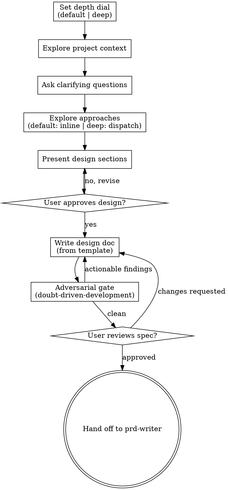

# Brainstorming Ideas Into Designs

Help turn ideas into fully formed designs and specs through natural collaborative dialogue.

Start by understanding the current project context, then ask questions one at a time to refine the idea. Once you understand what you're building, present the design and get user approval.

<HARD-GATE>
Do NOT invoke any implementation skill, write any code, scaffold any project, or take any implementation action until you have presented a design and the user has approved it. This holds for every feature, refactor, and bug fix, however simple it looks — with one carve-out, below, that is about size rather than about how simple something feels.
</HARD-GATE>

## Anti-Pattern: "This Is Too Simple To Need A Design"

A todo list, a single-function utility, a settings screen: all of them go through this process. "Simple" projects are where unexamined assumptions cause the most wasted work. The design can be short — a few sentences for a genuinely small feature — but you MUST present it and get approval.

The failure this guards against is rationalizing: deciding mid-task that the thing you already understand does not need a design. If you are arguing for the exception, you are the case it was written for.

## The one carve-out: mechanically trivial changes

A change is trivial when its shape is decided before you start and nothing about it is a judgment call: a typo, a mechanical rename, a formatting fix, a one-line config value, a broken link. No design exists to present — there is no alternative approach, no trade-off, nothing a user could approve differently.

For those, skip this skill and the chain: write the reason into `.specify/trivial` (one line) and make the edit. The phase-gate allows up to 10 lines while that marker is fresh and echoes the reason back. **Say in your response that you took the trivial path and why.**

The moment the change acquires a decision — an interface, a name others depend on, behavior, more than a handful of lines — it stopped being trivial and the gate above applies again. `doubt-driven-development` draws the same line for the same reason.

## Checklist

You MUST create a task for each of these items and complete them in order:

1. **Set the depth dial** — `default` (conversational, the default) or `deep` (opt-in framed divergence). See `## Depth dial`.
2. **Explore project context** — start from what SessionStart already injected: the product brief, the constitution, `docs/STATE.md`, and the OKF concept map (name, type, path, description of every documented concept). Those cost zero tool calls and already sit in your window; rediscovering them by reading files is waste. Then read only what is missing for THIS idea — the concepts the map points at, the code the feature touches, recent commits in that area.
3. **Ask clarifying questions** — one at a time, understand purpose/constraints/success criteria
4. **Explore approaches** — `default`: propose 2-3 inline with trade-offs and your recommendation. `deep`: dispatch framed divergence, then converge into 2-3 (see `## Depth dial`).
5. **Present design** — in sections scaled to their complexity, get user approval after each section
6. **Write design doc** — copy `.specify/templates/brainstorm-template.md` to `specs/<feature>/brainstorm.md` and fill each section
7. **Adversarial gate** — run `doubt-driven-development` against the written design before handoff; fix actionable findings (see below)
8. **User reviews written spec** — ask user to review the spec file before proceeding
9. **Hand off** — set `.specify/state` to the feature name and hand off to `prd-writer`

## Process Flow

**The terminal state is handing off to `prd-writer`.** Do NOT invoke any other implementation skill. The ONLY skill you invoke after brainstorming is `prd-writer`.

## The Process

**Understanding the idea:**

- Check out the current project state first (files, docs, recent commits)
- Before asking detailed questions, assess scope: if the request describes multiple independent subsystems (e.g., "build a platform with chat, file storage, billing, and analytics"), flag this immediately. Don't spend questions refining details of a project that needs to be decomposed first.
- If the project is too large for a single spec, help the user decompose into sub-projects: what are the independent pieces, how do they relate, what order should they be built? Then brainstorm the first sub-project through the normal design flow. Each sub-project gets its own spec → plan → implementation cycle.
- For appropriately-scoped projects, ask questions one at a time to refine the idea
- Prefer multiple choice questions when possible, but open-ended is fine too
- Only one question per message - if a topic needs more exploration, break it into multiple questions
- Focus on understanding: purpose, constraints, success criteria

**Exploring approaches:**

- `default`: propose 2-3 different approaches with trade-offs, present them conversationally, lead with your recommended option and explain why.
- `deep` (opt-in): when the design has real forks and the user opted in, run the framed divergence in `## Depth dial` instead — the 2-3 approaches you present are the critic's survivors, not options you anchored inline.
- Either way, the approaches (and which won, and why) land in the **Approaches Considered** section of the brainstorm doc.

**Presenting the design:**

- Once you believe you understand what you're building, present the design
- Scale each section to its complexity: a few sentences if straightforward, up to 200-300 words if nuanced
- Ask after each section whether it looks right so far
- Cover: architecture, components, data flow, error handling, testing
- Be ready to go back and clarify if something doesn't make sense

**Design for isolation and clarity:**

- Break the system into smaller units that each have one clear purpose, communicate through well-defined interfaces, and can be understood and tested independently
- For each unit, you should be able to answer: what does it do, how do you use it, and what does it depend on?
- Can someone understand what a unit does without reading its internals? Can you change the internals without breaking consumers? If not, the boundaries need work.
- Smaller, well-bounded units are also easier for you to work with - you reason better about code you can hold in context at once, and your edits are more reliable when files are focused. When a file grows large, that's often a signal that it's doing too much.

**Working in existing codebases:**

- Explore the current structure before proposing changes. Follow existing patterns.
- Where existing code has problems that affect the work (e.g., a file that's grown too large, unclear boundaries, tangled responsibilities), include targeted improvements as part of the design - the way a good developer improves code they're working in.
- Don't propose unrelated refactoring. Stay focused on what serves the current goal.

## After the Design

**Documentation:**

- Copy `.specify/templates/brainstorm-template.md` to `specs/<feature>/brainstorm.md`, where `<feature>` is the next `NNN-kebab-name` ordinal (same numbering scheme `prd-writer` uses: highest existing `specs/*` ordinal + 1, zero-padded to 3 digits). Fill each section (Understanding / Investigation / Approaches Considered / Open Decisions / Solution Outline) and the `status`/`feature`/`date` frontmatter. This template is the durable capture of the reasoning trail — the exploration, the trade-offs, the open points — upstream of `spec.md`/`plan.md`. No code, only intent and contracts.
- Set `.specify/state` (single line, no trailing content) to `NNN-kebab-name` so it becomes the active feature for `prd-writer`.
- Do NOT commit the design document — this repo commits at feature/milestone boundaries with explicit human approval, not per artifact.

**Adversarial Gate:**
After writing the design doc, run `doubt-driven-development` against it before handing off — a fresh-context reviewer that tries to *disprove* the design while course-correction is still cheap. This replaces the old cosmetic self-review: the point is an attack, not a proofread.

- **EXTRACT** the design's contract (the Outline + the closed decisions) and hand the reviewer that artifact **without** your reasoning or your conclusion.
- **DOUBT:** the adversarial brief is *"here is a proposed design and its constraints — find where it is wrong, unsafe, under-scoped, or built on an unstated assumption."*
- **RECONCILE** each finding: actionable → fix the doc; contract misread → tighten the EXTRACT; trade-off → record it in Open Decisions (or as closed, with the rationale); noise → discard. Bounded at 3 cycles; escalate rather than grind a fourth.
- Fold the old quick checks into this pass: placeholder scan (no "TBD"/"TODO"/vague requirements), internal consistency, scope (single plan or decompose?), and ambiguity (each requirement interpretable one way). A finding here is just another actionable.

Skip the full adversarial dispatch only for a truly trivial, reversible design (`default` on a one-liner) — there, the fold-in checks alone suffice; say so explicitly.

**User Review Gate:**
After the adversarial gate comes back clean, ask the user to review the written spec before proceeding:

> "Design written to `specs/<feature>/brainstorm.md`. Please review it and let me know if you want to make any changes before we hand off to prd-writer."

Wait for the user's response. If they request changes, make them and re-run the spec review loop. Only proceed once the user approves.

**Hand-off:**

- Hand off to the `prd-writer` skill to turn the approved design into the feature's PRD.
- Do NOT invoke any other skill. `prd-writer` is the next step.

## Depth dial

Set once, up front. The dial scales the **process**, not just the doc length — small features stay conversational, real design forks unlock divergence.

**`default`.** The conversational flow: explore context, ask one question at a time, propose 2-3 approaches inline, present the design. This is the right choice for most features, and for anything the off-signals already wave through (a typo, a rename, a trivial config, a 1-file change) — those barely need a dial at all. Do not reach for `deep` by default; it costs subagents.

**`deep` (opt-in).** For a design with **genuine forks** — an architecture choice under real uncertainty, an API surface, a naming/modeling decision where the first idea anchors all the others. Offer it; do not impose it. When the user opts in, run framed divergence → convergence:

1. **Diverge.** Dispatch a small fixed set of **isolated** idea-agents (via `dispatching-parallel-agents`, cheapest capable model — divergence is generative, not precise). Each agent sees the problem plus **one cognitive frame** and is told to generate, **not** evaluate. Agents do not see each other — no cross-anchoring. A lean, generic frame set (not codebase-specific): `skeptical-user`, `maintenance-6-months-later`, `worst-case-load`, `first-principles`, `simplest-path`. Pick 3-4 relevant to the fork.
2. **Converge (critic).** A single fresh pass over all branches: score each idea (novelty / viability / fit), flag traps (seductive-but-broken, with the reason), cluster by underlying angle, and deepen the top 2-3 survivors into approaches with risks and first steps.
3. The survivors become the 2-3 approaches you present, and land in **Approaches Considered** with the trade-off trail.

`deep` is the framed-divergence primitive borrowed from the adhd pattern, built entirely on keel's own dispatch — not a separate framework. It is a rare, opt-in mode, never the default.

## Key Principles

- **Ask one question at a time** - Don't overwhelm with multiple questions
- **Multiple choice preferred** - Easier to answer than open-ended when possible
- **YAGNI ruthlessly** - Remove unnecessary features from all designs
- **Explore alternatives** - Always propose 2-3 approaches before settling
- **Incremental validation** - Present design, get approval before moving on
- **Be flexible** - Go back and clarify when something doesn't make sense

## Visual Companion (optional)

For genuinely visual questions — a real mockup, layout, or diagram question, not merely a UI topic — a browser-based visual companion tool can be offered just-in-time (its own message, not upfront) so options can be shown rather than described. If no visual question ever arises, never offer it, and text-only dialogue is the default.
