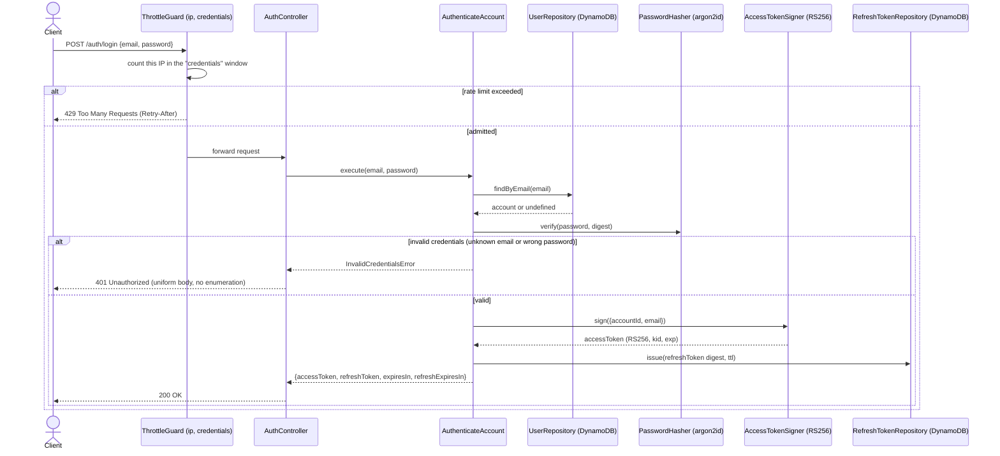
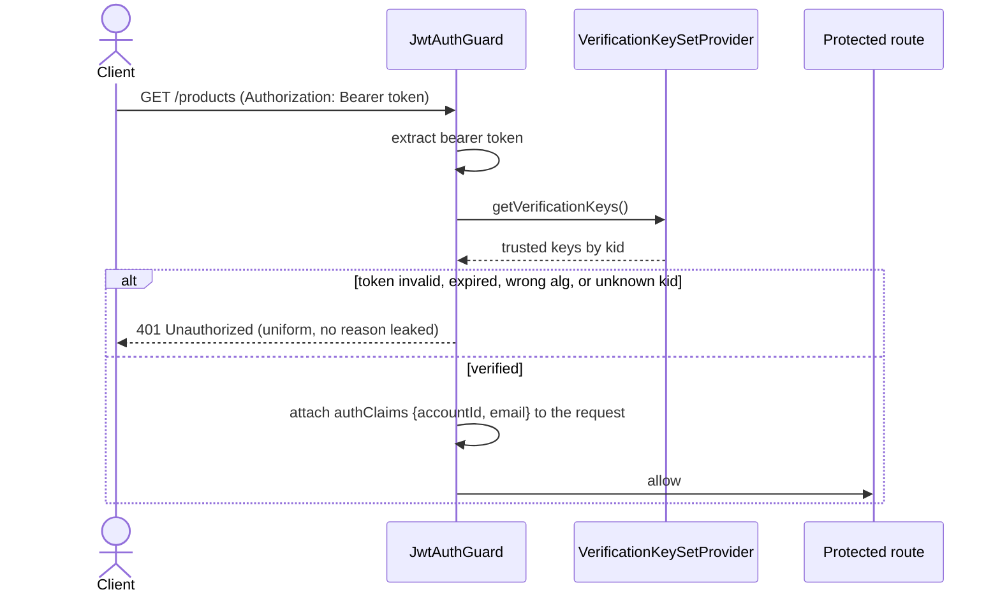
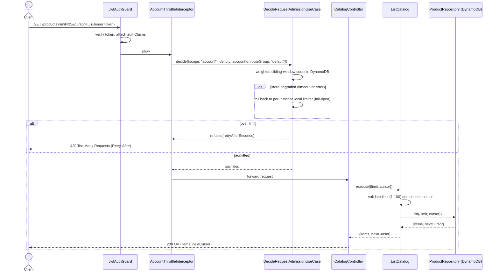

# Request flows

Sequence diagrams for the two flows the SWE Challenge brief asks for: signing in securely, and
reading the catalog through the protected, paginated, rate-limited endpoint.

## Login

`POST /auth/login` is public but IP-throttled (`credentials` group). Both rejection branches —
unknown email and wrong password — return the same `401` with a dummy argon2 verify on the
unknown-email path, so failed attempts cannot be used to enumerate accounts by timing (see
[ADR-0006](adr/0006-accept-email-enumeration-at-registration.md) for the related registration
trade-off).

Every other route defaults to protected. `JwtAuthGuard` is registered globally and runs before any
handler, verifying the access token against the current JWKS before letting the request through:

## Product listing (paginated, rate-limited)

`GET /products` sits behind `JwtAuthGuard` (above) and `AccountThrottleInterceptor`
(account-scoped, not IP-scoped — the caller is already known). Admission is decided by a weighted
sliding-window counter in DynamoDB; if that store is slow or unreachable, the use case fails open
to a coarse per-instance limiter rather than blocking every caller on one dependency
([ADR-0002](adr/0002-approximate-sliding-window-counter-in-dynamodb.md),
[ADR-0003](adr/0003-fail-open-when-the-throttling-path-fails.md)).

